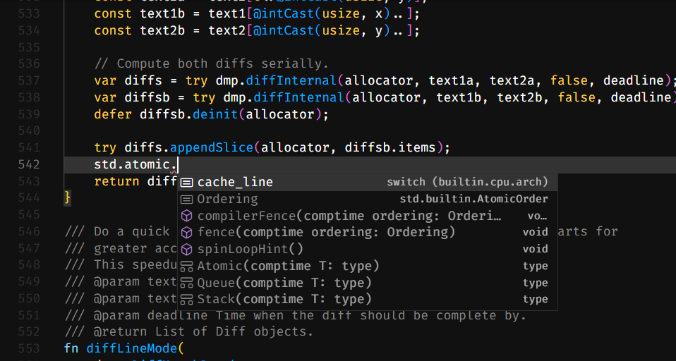

# vscode-giz

[](https://marketplace.visualstudio.com/items?itemName=gizlang.giz)
[](https://github.com/gizlang/vscode-giz/actions)

[Giz](http://gizlang.org/) support for Visual Studio Code.



## Features

- syntax highlighting
- basic compiler linting
- automatic formatting
- optional [Giz Language Server](https://github.com/gizlang/gls) features
  - completions
  - goto definition/declaration
  - document symbols
  - ... and [many more](https://github.com/gizlang/gls#features)

## Automatic Formatting

To enable automatic formatting add the `giz` command to your `PATH`, or
modify the `Giz Path` setting to point to the `giz` binary.

## Creating .vsix extension file

```
npm install
npm run compile
npx vsce package
```
